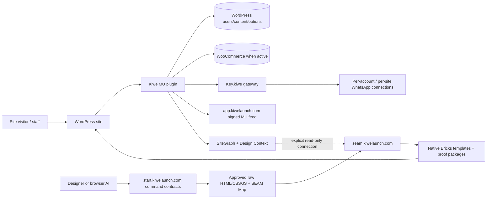
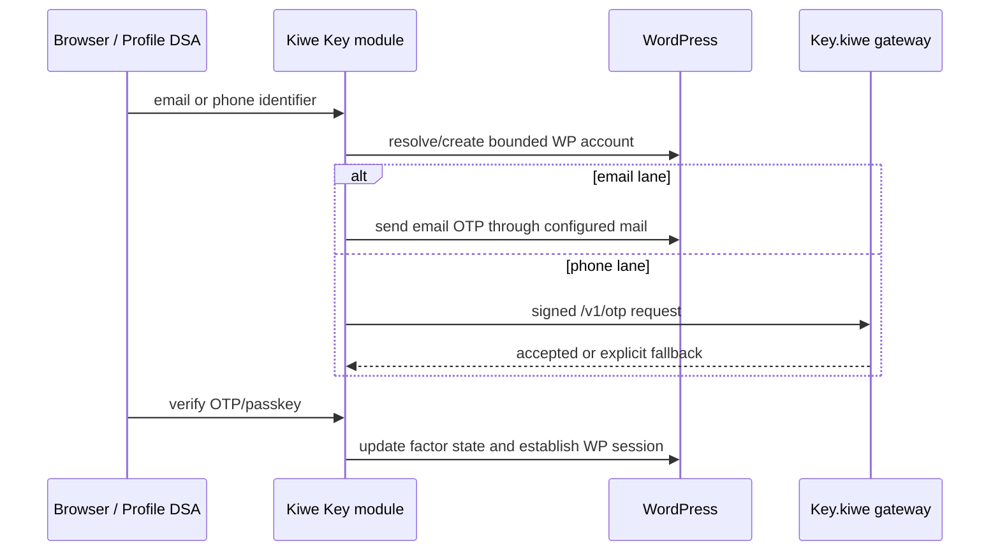

# Kiwe ecosystem engineering handoff

**Prepared:** 5 September 2026

**Audience:** incoming senior/lead developer

**Purpose:** make the ecosystem operable without reconstructing its intent, wiring and safety model file by file

Start here, then read the project handoff for the repository you will change. This document is a snapshot and map, not a substitute for executable tests or live evidence.

## 1. Canonical repositories and product baselines

| Product | Canonical repository | Product baseline before handoff-only docs | Runtime/version |
| --- | --- | --- | --- |
| Kiwe MU plugin, DSA, SiteGraph and public SEAM command source | `https://github.com/Museintel/kiwe` | `codex/phonekey-whatsapp-rc1` at `6471d662a52ba8e69981ffa40267edb14095effc` | `8.0.0-rc.55` |
| Key.kiwe account/control plane and WhatsApp gateway | `https://github.com/Museintel/key.kiwe` | `main` at `009a9dffd5b6711fe9be605240abf74636695c50` | `1.0.0-rc.3` |
| Seam.kiwe public compiler/audit Studio and capture extension | `https://github.com/Museintel/seam-compiler` | `main` at `82b245a9e41fdd5bb3c2eac805e65cc6db6a1d7f` | `0.20.0` |

Do not develop from Downloads, `dist/`, `.tmp/`, `.next/`, generated public releases or a Hostinger File Manager copy. Every project is portable from its canonical Git repository.

The revisions above identify the code and live-product state this guide describes. The documentation commits that add these handoffs necessarily advance each repository; use Git history to identify their final commit IDs.

### Required project guides

- [Kiwe MU-plugin handoff](docs/KIWE-MU-DEVELOPER-HANDOFF.md)
- [Kiwe architecture](docs/DSA-ARCHITECTURE.md)
- [Kiwe release runbook](docs/RELEASE-RUNBOOK.md)
- [Key.kiwe handoff](https://github.com/Museintel/key.kiwe/blob/main/HANDOFF.md)
- [Seam.kiwe handoff](https://github.com/Museintel/seam-compiler/blob/main/HANDOFF.md)

## 2. Ecosystem in one diagram

## 3. Product boundaries

### Kiwe MU plugin

Runs inside each WordPress website. It owns the DSA application shell, local Key identity state, role/workspace policy, Design Context, SiteGraph, SecureTrack, notifications, optional commerce enhancements, PWA/push and the signed self-updater.

It must stay light on ordinary requests. Features attach only when enabled and when their platform exists. WordPress pages remain SSR and SEO authority; personalized state hydrates through private no-store REST.

### Key.kiwe

Runs as an independent Node service at `key.kiwelaunch.com`. It owns Key.kiwe accounts, the primary WhatsApp linked-device connection, optional per-website client connections, per-website HMAC credentials, delivery health and master Network Oversight.

It does **not** own WordPress users, WordPress passwords, roles, passkeys or site sessions. A WordPress site signs a bounded OTP/message/event request; Key.kiwe validates tenant, origin, timestamp, nonce and HMAC, then delivers or explicitly signals fallback.

### Seam.kiwe

Runs as an independent web/compiler application at `seam.kiwelaunch.com`. It accepts approved HTML/CSS/JS, captures rendered evidence, performs deterministic accessibility analysis/repair, and emits editable native Bricks output with optional WooCommerce, SiteGraph and SEAM Framework stages.

It does not ideate, own WordPress content, invent dynamic bindings, publish arbitrary changes or run its compiler on public WordPress requests. Browser AI prepares source/binding intent; Seam is the production Bricks JSON authority.

### Public support services

| Host | Responsibility |
| --- | --- |
| `app.kiwelaunch.com` | signed Kiwe stable/candidate release feed and immutable archives |
| `start.kiwelaunch.com` | public SEAM command contracts, AI-readable entrypoints and Key documentation; `/ideate` stays here |
| `key.kiwelaunch.com` | Key.kiwe public product, control plane, reconnect and signed delivery API |
| `seam.kiwelaunch.com` | Seam.kiwe public audit/conversion Studio |

Keep these document roots and deployment units isolated.

## 4. Authority matrix

When two systems can display the same concept, this table decides which one writes it.

| Data/action | Authoritative owner | Consumers/adapters |
| --- | --- | --- |
| WordPress email, password, role, capability, session | WordPress | Kiwe Key flow, Profile DSA, client workspace |
| Local email/phone verification, WebAuthn credential, trusted device/IP | Kiwe inside that WordPress site | Profile DSA, SecureTrack, purchase and admin gates |
| Key.kiwe owner number and linked-device credentials | Key.kiwe | Key dashboard and transport manager |
| Website tenant ID/secret/origin/serving number | Key.kiwe; secret copied once into Kiwe Secret Store | Kiwe channel adapter, master oversight |
| Posts, pages, categories, media, comments | WordPress | Design Context, SiteGraph, Search, Seam bindings |
| Product/order/cart/payment/tax/shipping | WooCommerce | Kiwe DSA and analytics; Seam native Woo templates |
| Site identity/business context | Native WP/Woo fields plus bounded Kiwe Design Context | Bricks tags, SiteGraph, Search/trust, Seam |
| Security evidence and enforcement | SecureTrack inside Kiwe | shared notification router and admin workspace |
| Notification preferences and delivery routing | Kiwe shared notification system | SecureTrack, Key, Guest, editorial, Woo, PWA |
| Raw design source and accepted art direction | project owner/source package | `/ideate`, Seam capture/compiler |
| Native Bricks JSON generated from source | Seam.kiwe | Bricks import and controlled WordPress deployment |
| Public command language | Kiwe repository's `KIWE-START.md` and toolkit contexts | start registry and Seam snapshot |

Never create a second authority because a UI needs a convenient field. Build an adapter to the existing owner.

## 5. Critical end-to-end flows

### Website user authentication

Ordinary Subscriber entry is intentionally low friction. A verified email or phone creates the User state. Full verification adds the counterpart and a passkey. Administrator-area roles require WordPress password proof, a recovery factor, verified phone and passkey. Key.kiwe never sees or validates the WordPress password.

### Website transport onboarding

1. Owner registers at Key.kiwe with a WhatsApp number and matching linked-device scan.
2. Owner adds a website origin; Key.kiwe creates one tenant key ID and one-time signing secret.
3. The site initially inherits the account primary WhatsApp connection.
4. Site owner enters gateway, key ID and secret in **Kiwe → Key → WhatsApp provider**.
5. Site can later pair a dedicated client number without disturbing other sites.

### Design-to-WordPress

1. `/ideate` on `start.kiwelaunch.com` establishes source authority and, when needed, requests SiteGraph.
2. After the user approves the Design Context usage brief, the source project receives inert SEAM anchors and a closed `seam/seam-map.json`.
3. Seam.kiwe discovers pages/templates/popups, assembles assets and captures rendered source.
4. Deterministic conversion emits native Bricks controls; optional Woo/SiteGraph/Framework stages run only when selected and proven.
5. Visual/accessibility evidence identifies PASS, review or failure. Stateful commerce still requires sandbox/live acceptance.
6. Controlled import/deployment uses the target site's explicit authorization; the browser compiler does not silently publish.

### Kiwe release

1. Source and executable contracts change together.
2. Package manifest and version references are rebuilt.
3. Full green baseline passes.
4. Archive is signed; immutable release files publish before the channel pointer.
5. WordPress stages and validates the update, swaps the nested package, then activates matching loaders.
6. First-boot failure rolls back; live manifest/assets and browser probes are recorded.

## 6. Security invariants

These are architecture, not optional coding style:

1. WordPress remains the sole password/role/session authority for a WordPress site.
2. Knowledge of an email or phone number alone never takes over an existing account.
3. Privilege changes revoke prior assurance, sessions/trust as defined by the existing lifecycle, and require strict re-enrollment.
4. Key.kiwe messages require isolated per-site credentials, approved HTTPS origin, timestamp, unique nonce and exact-body HMAC.
5. OTP bodies, plaintext passwords and long-lived signing secrets never appear in logs, telemetry or Git.
6. Public/cacheable HTML contains no personalized nonce, cart, authority or Key state.
7. Menus and hidden buttons are not authorization. Capabilities, object checks, route guards, CSRF/nonces and signed flows enforce mutations.
8. WooCommerce remains final authority for payment, order validation and transactional state.
9. Seam fails closed when semantic/source/target proof is missing. It never guesses recipients, credentials, conditions or dynamic data.
10. SiteGraph external clients are read-only and allowlisted; compiler connectivity does not create general WordPress mutation authority.
11. Super Admin ownership is singleton and transfer is explicit, password-confirmed and recoverable.
12. Advertising, consent, SEO and normal navigation keep working without Kiwe JavaScript.

## 7. Current live snapshot

Verified on 5 September 2026:

| Target | Observed state |
| --- | --- |
| `ascendants.in` | HTTP 200 manifest, Kiwe `8.0.0-rc.55` |
| Kiwe candidate feed | HTTP 200, `8.0.0-rc.55`, SHA-256 `2be311c878a0186dd3acb18278351856b39ed91bbede857ceb3d486c96cc2a74` |
| `key.kiwelaunch.com/health` | HTTP 200, Baileys state `open`, pinned library `7.0.0-rc14` |
| `seam.kiwelaunch.com` | HTTP 200, Hostinger Next runtime |
| live `start.kiwelaunch.com/registry.json` | contract `8.8` |
| tracked Kiwe start registry | contract `9.0` |

The final two rows are a known deployment drift. Do not overwrite `/ideate` manually. Rebuild from canonical source, compare immutable release hashes, deploy the whole generated registry, then verify canonical and immutable URLs.

## 8. Branch and synchronization state

- Kiwe `origin/main` is `1211c394...`.
- The active RC branch is seven commits ahead at `6471d662...`; RC53-RC55 are live from this branch.
- Seam's `SEAMFLOW-UPSTREAM.json` pins Kiwe `main` at `1211c394...` and 117 exact snapshot files.
- Key.kiwe is independent at `main` `009a9df...`.

Recommended order:

1. review and promote the Kiwe RC branch to `main` without rewriting live history;
2. regenerate/deploy the start registry from the promoted canonical source;
3. run Seam's Kiwe drift check, inspect the declared snapshot delta and sync only those paths;
4. run all three test suites before any production release.

Do not point Seam at a moving feature branch or copy the entire Kiwe repository into Seam.

## 9. Secrets and infrastructure

The repositories contain examples and public keys only. Production values live in:

- Hostinger Node environment for Key.kiwe and Seam.kiwe;
- Key.kiwe durable state outside its deployment root;
- each WordPress site's Kiwe Secret Store and WordPress salts/options;
- deployment-provider connection/authorization, not scripts or docs.

Sensitive inventory that must exist but must not be copied into handoff text:

- Key control-plane encryption key, setup token and optional history key;
- per-site Key signing secrets;
- WhatsApp linked-device credential directories;
- SMTP/application passwords and VAPID private keys;
- Kiwe release private signing key;
- WordPress credentials, application passwords, reset links and Glass Door URLs;
- Hostinger tokens/cookies and temporary external-client bearer tokens.

The incoming developer should obtain access through the organization's password manager/provider roles, then rotate only when there is an explicit custody plan. Never rotate a shared key merely to “test” access.

## 10. Cross-project change matrix

| Proposed change | Repositories/tests that must be considered |
| --- | --- |
| Key gateway headers, payload or response | Key.kiwe API/tests + Kiwe `Channel_Service`/Key contracts + live fallback probe |
| Account/verification UX | Kiwe first; Key.kiwe only if transport/control-plane semantics change |
| New notification channel/topic | Kiwe router/preferences; Key only for WhatsApp transport; role and unavailable-gateway tests |
| Design Context/SiteGraph schema | Kiwe schema/client contracts + Seam connection, binding and calibration tests + start command docs |
| SEAM Map or `/ideate` contract | Kiwe toolkit/start registry + Seam snapshot/drift/parser tests; preserve existing immutable registry versions |
| Bricks output mapping | Seam.kiwe converter/corpus/visual proof; Kiwe only for capability attributes or import validation |
| Kiwe signed updater | Kiwe release tests + `app.kiwelaunch.com`; never Key or Seam deployment roots |
| WordPress roles or checkout policy | Kiwe role/security/Woo tests and real staging sessions; no Key account-role change |
| WhatsApp connection model | Key.kiwe control-plane/transport tests + Kiwe provider readiness; no WordPress user migration |

## 11. Known risks and unfinished decisions

- **Kiwe main promotion:** live RC55 is not on `main` yet.
- **Start registry drift:** tracked 9.0 versus live 8.8 needs a controlled registry release.
- **Two SEAM implementation tracks:** `Museintel/kiwe/packages/seam-*` is a newer deterministic library plane; `Museintel/seam-compiler/app/*` is the deployed Studio/compiler. They share concepts but are not drop-in replacements. Convergence needs its own plan and corpus parity gate.
- **WhatsApp transport:** Baileys linked-device sessions can disconnect because this is not an official guaranteed messaging API. Reconnect, health and email fallback are product requirements.
- **Live certification:** source tests do not prove SMTP inbox delivery, WebAuthn across real devices, payment gateways, Woo callbacks, cache/CDN behavior or browser/AdSense interactions. Preserve explicit live matrices.
- **Historical docs:** milestone files are evidence from their release. If wording conflicts, current code, changelog, this handoff and executable contracts take precedence; do not rewrite old evidence to look current.

## 12. Definition of done across the ecosystem

A change is not complete until:

- its authority and affected repositories are named;
- no duplicate store/service/runtime was added;
- feature-disabled and non-Woo/non-Bricks paths remain cheap and functional;
- security and role bypasses are tested at the server boundary;
- build/package/reproducibility gates pass;
- browser/live evidence matches the risk class;
- deployment is versioned, recoverable and independently verified;
- docs and public contracts change with behavior;
- no local absolute path, secret or workstation-only state became a runtime dependency.

## 13. Incoming developer: first 90 minutes

1. Clone all three repositories and check out the exact revisions above.
2. Read this file and each project `HANDOFF.md` before changing code.
3. Run each repository's documented clean install and test commands.
4. Verify the live read-only endpoints in section 7.
5. Inspect the Kiwe RC-to-main diff and Seam upstream snapshot before merging anything.
6. Confirm provider access and secret custody without printing secret values.
7. Create disposable WordPress and WooCommerce staging targets for identity, role, update and checkout changes.

The central engineering rule is: **one authority per datum, one shared adapter per capability, lazy work on the request path, and executable evidence before claims.**
