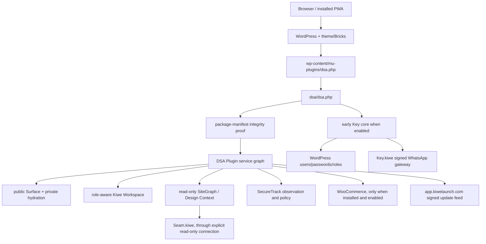
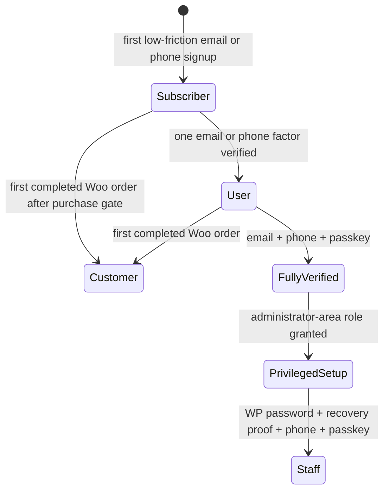

# Kiwe MU-plugin developer handoff

**Snapshot:** 5 September 2026

**Repository:** `https://github.com/Museintel/kiwe`

**Canonical branch:** `main`

**Reviewed promotion baseline:** `981459327a8207d470a76505e3f63d2d8fc6ba68`

**Release code commit:** `19634ec`

**Installed candidate:** `8.0.0-rc.55`

**Supported floor:** WordPress 7.x, PHP 8.2, HTTPS; Bricks and WooCommerce are optional integrations

This is the implementation map for the WordPress product. It explains ownership and wiring so a maintainer can work from architecture and contracts rather than reverse-engineering individual files. Historical decision detail remains in [DSA-ARCHITECTURE.md](DSA-ARCHITECTURE.md); this document is the current operational truth.

## 1. Product boundary

Kiwe is a must-use WordPress application layer. It keeps normal WordPress pages server-rendered and indexable, then adds one lazy, persistent **Dual Surface Area (DSA)** for app-like navigation, search, identity, saved items, notifications, trust, commerce and protected actions.

Kiwe is not:

- a replacement theme or client-rendered SPA;
- the central WhatsApp transport service—that is Key.kiwe;
- the public HTML/CSS/JS-to-Bricks compiler—that is Seam.kiwe;
- a second owner of WordPress users, passwords, posts, pages or WooCommerce orders;
- an Ascendants-specific fork.

The plugin is intentionally generic. Ascendants is the first live proving site and its settings/data remain in that WordPress installation.

## 2. Runtime topology



### Boot sequence

1. `wp-content/mu-plugins/dsa.php` is the only WordPress-discovered loader.
2. The loader recovers an interrupted update transaction before loading anything else.
3. `dsa/dsa.php` enforces PHP 8.2+, loader/package version equality and autoloading.
4. If Key login is enabled, `includes/PhoneKey/phonekey-core.php` loads before the wide service graph. An already-open sign-in journey therefore keeps its REST routes even during a slow or partially copied wider boot.
5. `Runtime/Package_Manifest.php` verifies release integrity. Blocking drift disables Kiwe for that request while keeping WordPress alive.
6. Memory-sensitive media generation can take the lean Incident Guard path and skip the large graph.
7. `includes/Plugin.php` creates the dependency graph and registers services on `muplugins_loaded`.

Do not create a second bootstrap or load the nested `dsa/dsa.php` as a normal plugin. Loader and package versions must always match.

## 3. What owns what

| Concern | Authority | Kiwe's role |
| --- | --- | --- |
| Users, email address, password, roles, capabilities, sessions | WordPress | Adds bounded authentication/verification state and stricter policy; never replaces WordPress identity |
| Phone verification, passkeys, trusted devices | Kiwe Key module in the WordPress site | Stores local factor/credential state and asks Key.kiwe only to deliver WhatsApp messages |
| WhatsApp account, linked-device connection, per-site transport credentials | Key.kiwe service | Calls its signed, origin-bound API through the shared channel layer |
| Posts, pages, media, comments, taxonomies | WordPress | Presents simpler role-aware workflows and read-only Design Context projections |
| Products, orders, checkout, payment, shipping, tax | WooCommerce | Adds optional DSA presentation, identity gates, analytics and notifications; Woo remains transactional authority |
| Site identity, story, contact, brand, services, conditional store context | Native WordPress/Woo data plus Kiwe Design Context fields | Gives nontechnical administrators one safe business workspace and exposes a bounded SiteGraph |
| Bricks content/templates/settings | Bricks | Adds dynamic tags, attributes and guarded integration; only the Super Admin may use the builder under the ownership policy |
| Search ranking/index data | WordPress queries; optional SecureTrack aggregate views | Provides cached live Search UI and sort choices |
| Security observations and blocks | SecureTrack inside Kiwe | Records evidence independently of whether a notification is delivered |
| Notifications | Shared Kiwe notification router | Sources publish topics; one preference/channel system sends inbox, email, WhatsApp, SMS or app push |
| Compiler output | Seam.kiwe | Kiwe validates SiteGraph connections and controlled import/deployment, but never asks browser AI to manufacture Bricks JSON |

## 4. Service graph and feature gates

`includes/Plugin.php` is the composition root. Constructors wire services; `register_services()` decides which hooks and REST controllers exist for the request.

### Always or policy-critical

- settings migration and package/runtime diagnostics;
- atomic rate limiter;
- signed updater;
- site-owner and role policy;
- Guest application policy;
- shared notification ingress;
- WordPress 7 feature-detected adapters;
- site identity and Design Context services;
- SecureTrack loader;
- read-only SiteGraph and settings controllers.

These remain available even if the public Surface or Key login is disabled because ownership, recovery and business data cannot depend on a front-end feature switch.

### Explicitly gated

| Gate | Services attached only when true |
| --- | --- |
| `dsa_settings.enabled` | public assets, Surface renderer, private hydration, Search, Saved, editorial envelope, PWA-facing permission UI |
| `phonekey.enabled` | Key core, account controller and Woo purchase-identity lifecycle |
| active Woo + cart/checkout setting | cart/checkout controllers and checkout hooks |
| notification preferences enabled | preference routes, admin/order event consumers and inbox delivery |
| push enabled | push storage/delivery routes |
| metrics, abandoned carts or linked products enabled | analytics tables/hooks/controllers |
| AI Studio + Bricks companion enabled | Bricks Studio controller |
| Schema/GEO enabled + public Surface | schema output |

The fresh-install profile recursively disables optional booleans and enables only read-only SiteGraph. Do not infer runtime cost from the broad `defaults()` tree; `fresh_install_defaults()` is the install authority.

## 5. Feature map

| Area | User-visible responsibility | Primary implementation |
| --- | --- | --- |
| DSA lifecycle | One Screen/Sheet surface, history, focus, scroll preservation, close semantics, safe-area geometry | `Public_Endpoint/Surface_Renderer.php`, `assets/js/surface.js`, `assets/js/surface-panels.js`, `assets/css/*` |
| Dock/Menu | Configurable launchers, WordPress menus/categories, current route/category and H1-H3 table of contents | `Modules/`, Dock settings, Surface runtime |
| Search | Fast default/latest/popular results, posts/products conditionality, cached bounded queries | `Search/Search_Service.php`, `Rest/Search_Controller.php` |
| Profile | WordPress profile fields, avatar, email/phone verification state, password handoff, Guest badge | `PhoneKey/PhoneKey_Bridge.php`, `Rest/Account_Controller.php`, Surface panels |
| Key authentication | Email/phone identification, OTP, progressive verification, passkeys, new-device recovery, privileged strict flow | `PhoneKey/phonekey-core.php`, `PhoneKey/PhoneKey_Core_Loader.php`, Surface runtime |
| Saved | Bookmarks and Woo wishlists using user meta; logged-out intent resumes after authentication | `Saved/Saved_Items_Service.php`, `Rest/Saved_Items_Controller.php` |
| Cart/Checkout | Optional cart sheet and field collection; final validation/payment/order stay with Woo | `Commerce/*`, `Rest/Cart_Controller.php`, `Rest/Checkout_Controller.php` |
| Purchase identity | Guest/subscriber gate, one verified factor for purchase, Customer transition after first order | `Commerce/Purchase_Identity_Gate.php` |
| Trust | Deterministic SSL, payment, Key and security signals; no invented badges | `Trust/Trust_Service.php` |
| Notifications | Topic registry, role-aware policy, inbox, email/WhatsApp/SMS/push dispatch | `Notifications/*`, `Communications/*`, `docs/notification-architecture.md` |
| SecureTrack | IP/session/event tracking, rate limits, trusted IPs, monitor/enforce, severity and flood control | `Secure/*` |
| Guest contributions | Opt-in application, approval/denial, create-once post/product proposal, immutable author copy | `Access/Guest_Contribution_Service.php` |
| Client workspace | Native wp-admin restyled and route/capability constrained per role | `Access/*`, `Admin/Workspace_Admin_Service.php`, `assets/css/workspace-admin.css` |
| Design Context | Identity, Story, Contact, Brand, Website plan, opt-in Services, conditional Store and public team data | `Onboarding/*`, `docs/design-context-native-records.md` |
| SiteGraph | Bounded, cacheable public/business graph plus authenticated external-client read connection | `AI/Site_Graph_Service.php`, `Rest/Site_Graph_Controller.php` |
| Bricks | Dynamic tags, DSA launcher attributes, guarded controls and clean conversion validation | `Bricks/*` |
| PWA/Push | Install journey, service worker, permission state, subscriptions and bounded delivery | `PWA/*`, `Notifications/Push_Service.php`, `Rest/Push_Controller.php` |
| Metrics/Rewards | Aggregate surface events, store events, game/reward authority and abuse bounds | `Metrics/*`, `Rewards/*`, `Commerce/Store_Analytics_Service.php` |
| AI | Credential-blind broker, admin copilot and controlled mutation boundary | `AI/*`, `WP7/*` |
| Update/recovery | Signed stable/candidate release install, staging, atomic swap and loader rollback | `Runtime/Update_Service.php`, root loader, `tools/release/*` |

### Stable launcher attributes

Theme or Bricks controls open modules by attribute, not custom JavaScript:

```html
data-dsa-open-module="profile"
data-dsa-open-module="search"
data-dsa-open-module="menu"
```

In Bricks, add an attribute with **name** `data-dsa-open-module` and **value** `profile`, `search`, or `menu`. Do not store `data-dsa-open-module="profile"` as the value of an unrelated `profile` attribute.

## 6. Identity and role lifecycle

The product name is **Key.kiwe**. Internal directories, function prefixes, database tables and compatibility metadata still use `PhoneKey`/`pk_*`. That is intentional migration continuity. A cosmetic mass rename can orphan users, factors, encrypted data, routes and trusted devices.

### Front-end account states



- `subscriber`: lowest-friction front-end account; no wp-admin.
- `kiwe_user` (displayed as **User**): verified front-end account; no wp-admin.
- `customer`: Woo lifecycle role after a real order; no wp-admin by default.
- Full verification is a security state, not a WordPress role.
- Customer conversion changes only pure Subscriber/User accounts and never overwrites staff roles.

### Administrator-area roles

| Role | Effective workspace |
| --- | --- |
| `kiwe_super_admin` | Singleton full owner. All WordPress/plugin/Bricks/Kiwe controls and ownership transfer |
| `administrator` | Client workspace: posts, media, comments, users, bounded Pages and business sections; technical Kiwe/Bricks dashboards remain hidden and capability-blocked |
| `editor` | Edit/publish existing posts, including others'; cannot create a new post |
| `author` | Create/edit/publish own posts |
| `contributor` | Kiwe Guest compatibility role only after approval; create-once contribution workspace, no native editor |
| `shop_manager` | Only when Woo is active; product/media authoring, not Woo settings, orders or unrelated wp-admin areas |

Menus are only presentation. `WordPress_Role_Access_Service`, object-level capabilities, admin route guards, AJAX allowlists and REST pre-dispatch rules are the real boundary.

### Privileged authentication

Any role with administrator-area access must complete the strict flow:

1. own a WordPress password; Key-created users elevated later receive WordPress's one-time set-password link;
2. prove that password;
3. verify an email or phone recovery factor;
4. bind and verify a phone number;
5. assert an existing passkey or enroll one;
6. only then receive the privileged WordPress session and trusted-device/IP advancement.

Password creation/reset remains WordPress authority. Kiwe restyles the isolated `wp-login.php` document with Design Context/site branding and keeps reset bearer keys away from public themes, advertising and analytics. Existing or synced passkeys are asserted before enrollment; embedded mail/app webviews are directed to a full browser.

## 7. Persistence map

Table prefixes below use the site's actual `$wpdb->prefix`.

| Namespace | Important records | Notes |
| --- | --- | --- |
| WordPress core | users, usermeta, posts, postmeta, terms, options | Canonical account/content authority |
| `dsa_settings` | main nested settings option | Merge through `Settings`; never replace unknown branches during a partial save |
| `dsa_shell_manifest` | generated public shell manifest | Cache/build artifact, not business authority |
| `kiwe_access_policy_v1` | singleton owner, role migration and client policy | Network option on Multisite |
| `dsa_*` tables | atomic rate limits, store events, abandoned carts/reminders, notification preferences, push subscriptions | Created lazily by owning services |
| `pk_*` tables | challenges, credentials, factors, trusted devices, visits, activity | Local Key identity state; do not rename casually |
| `pk_*` user meta | anchor hashes, verification, password/privileged setup, passkey/TOTP state, trust | Sensitive; use existing helpers and revocation paths |
| `stp_*` tables | IPs, sessions, events, profiles, pages, alerts, subnets, brain, AI queue, rate limits | SecureTrack evidence and enforcement |
| WooCommerce | products/orders/sessions/HPOS and lookup tables | Woo owns writes and transactional validation |

Secrets belong in Kiwe's encrypted Secret Store or host configuration. Never put SMTP passwords, Key tenant secrets, VAPID private keys, tokens, Glass Door paths or account credentials in Git, screenshots, fixtures or handoff files.

## 8. Notifications

All current and future modules use one architecture:

```text
source event -> kiwe_notification_event(topic, payload)
             -> authorization + user preference
             -> bounded inbox
             -> configured Email / WhatsApp / SMS / app-push adapters
```

Security evidence is never deleted merely because delivery is disabled. SecureTrack applies severity, suppression and hourly budget before publishing. Administrators can choose yellow/informational topics as well as high-risk alerts, subject to channel availability. Add future notifications by registering one topic and publishing through the router; do not call `wp_mail()` or a WhatsApp webhook directly from a feature module.

## 9. Performance and cache model

The non-negotiable target is no material tax on sites that do not enable a feature.

- Public HTML stays SSR and cacheable.
- Personalized identity, nonce, cart and authority state never enters shared page HTML; `/dsa/v1/runtime/hydrate` returns it privately with no-store semantics.
- The Surface has one shared resident runtime. Large panels and commerce modules are lazy.
- Woo hooks are attached only after Woo exists; editorial sites do not run commerce queries merely because commerce code ships in the package.
- Search uses bounded WordPress queries and object-cache identities; Popular asks SecureTrack only when selected.
- Admin publishing must not synchronously send notification floods, scan the whole site or call slow providers. Background-capable work uses the existing cron/Action Scheduler adapters.
- Diagnostics and runtime profiling are off by default.
- The lean media path avoids booting the wide graph during image sub-size work.
- Never solve performance by caching personalized REST responses or weakening capability checks.

Before accepting a performance change, measure anonymous front page, authenticated DSA hydration, wp-admin post publish, Search, Key identification and a non-Woo site. See `tools/runtime/securetrack-publish-performance-contracts.cjs` and the release baseline.

## 10. Public and extension contracts

Primary REST namespace is `dsa/v1`; the legacy Key namespace remains `phonekey/v1` for compatibility. Important controller families:

- private runtime hydration;
- Search, Saved, account/profile, cart and checkout;
- notification preferences/inbox and push;
- metrics, rewards and permission journeys;
- settings, SiteGraph, AI access and Bricks Studio;
- editorial envelope and APEX profile;
- Key identify/verify/resend/recovery/passkey/TOTP/backup/account-factor routes.

Every mutation must retain:

- a specific permission callback or signed flow token;
- `X-Kiwe-Mutation`/nonce ownership where the existing controller requires it;
- same-origin/fetch-metadata protections;
- bounded input and rate limiting;
- server-authoritative role/object validation.

Public SiteGraph is intentionally read-only and redacted. Seam's external connection uses a short-lived bearer token and an allowlisted read/convert/validate surface; it gains no arbitrary WordPress mutation authority.

## 11. Admin ownership

- Full technical settings belong to the singleton Super Admin.
- Client Administrators use the Kiwe Workspace and top-level business sections: Identity, Story, Contact, Brand, Website plan, Services when enabled, and Store only when commerce exists.
- WordPress Media is the Design Context resource library; there is no parallel resource store.
- Public Team uses selected eligible WordPress users and safe public profile fields. Passwords, roles, security metadata and private plugin data are never exported.
- Pages remain native. Client Administrators can list them, create a title-only draft and set indexing; they cannot edit/delete the built page or open Bricks.
- Bricks full/edit/code/SVG/submission access is clamped to the Super Admin under active ownership policy.
- Do not expose **Users → Access & ownership** to a client Administrator. Its capability is owner-only.

## 12. Release and deployment

### Canonical source

Only these are deployable source:

```text
wp-content/mu-plugins/dsa.php
wp-content/mu-plugins/kiwe-incident-guard.php   # when present in the release
wp-content/mu-plugins/dsa/
```

`dist/`, `.tmp/`, `tmp/`, downloaded ZIPs and old Hostinger archives are not editable source.

### Release gate

```powershell
node tools/release/verify-green-baseline.cjs
node tools/release/build-package-manifest.cjs
node tools/release/verify-package.cjs
node --check tools/release/build-signed-update.mjs
```

The release process must:

1. bump root loader, nested package and cache-visible version references together;
2. update `CHANGELOG.md` and relevant contracts;
3. rebuild and verify `dsa/package-manifest.json`;
4. run the full green baseline and appropriate browser/live probes;
5. build the Ed25519-signed archive with `build-signed-update.mjs`;
6. publish immutable release archive/manifest first and the channel pointer last;
7. install the nested package first and root loader(s) last;
8. purge caches, then independently read the installed manifest and versioned assets;
9. record deployment evidence in `docs/`.

The WordPress updater supports `stable` and `candidate`, manual update and optional automatic update. The feed is `https://app.kiwelaunch.com/updates/kiwe/v1/`; its public verification key is pinned in source. Never bypass signature, archive or inner-manifest verification.

For Hostinger, the reusable scoped uploader is `tools/release/upload-mu-plugin-tus.mjs`. Follow [RELEASE-RUNBOOK.md](RELEASE-RUNBOOK.md) and [INSTALL-HOSTINGER.md](INSTALL-HOSTINGER.md), including package-first/loader-last ordering.

### Recovery

- Interrupted installer: root loader reads `kiwe-update-transaction.json` and restores the verified backup.
- Bad first boot: loader catches Kiwe failures, leaves WordPress available and rolls back an `awaiting_boot` transaction.
- Emergency disable: rename only `wp-content/mu-plugins/dsa.php` to `dsa.disabled.php` after confirming the exact path. Do not delete tables/options as routine rollback.
- Ownership recovery: use the documented WP-CLI option patch; never delete the owner or policy blindly.

The per-site Glass Door URL is a recovery secret. Discover it from that site's authorized configuration at the time of an incident; do not commit it to this repository.

## 13. Verification map

| Change touches | Minimum targeted evidence |
| --- | --- |
| Any production PHP/JS/CSS | full `verify-green-baseline.cjs`, package verification, syntax/lint |
| Key flow | progressive, strict, role-commerce, route-resilience and WordPress-identity contracts; real browser when WebAuthn changed |
| Surface geometry/history | profile/menu geometry, mobile overlay/AdSense contracts, Playwright at phone/tablet/desktop |
| SecureTrack | lockout and publish-performance contracts plus monitor/enforce live session |
| Roles/admin | client workspace, owner handoff, Guest/notification contracts and real accounts per role |
| Woo | non-Woo isolation plus classic and Store API checkout/order lifecycle |
| Notification | channel availability, preference authorization, flood budget and failure isolation |
| Update system | signed-update contracts, staged swap, interrupted transfer and rollback drill |
| SiteGraph/Seam | client, adapter, Design Context and task-capsule contracts; no mutation expansion |

Current live proof for RC55 is [rc55-deployment-2026-09-05.md](rc55-deployment-2026-09-05.md).

## 14. Common change recipes

### Add a DSA module

Register it through `Module_Registry`; declare visibility, data, render/bind behavior, dismissal and protected-flow escalation. Reuse the shared Surface. Do not add a second overlay root, global runtime or independent geometry system.

### Add a notification

Register/authorize one topic and emit `kiwe_notification_event`. Reuse channel readiness and user preferences. Never embed gateway credentials or dispatch directly from the source module.

### Add a commerce feature

Prove active WooCommerce before registering hooks or querying Woo tables. Keep payment/order authority in Woo, add a non-Woo isolation test, and preserve staff roles during Customer transitions.

### Add a user field

Choose the existing native owner first (WordPress user/user-meta or Woo billing field), add a narrow sanitizer and permission check, project only safe public data into SiteGraph, and update Profile without creating a second account store.

### Add an admin capability

Define object/action authority first, then menu visibility. Cover direct URL, REST, AJAX and metadata bypasses. Check Super Admin, client Administrator, each editorial role and front-end-only roles.

### Change Key.kiwe integration

Preserve internal `pk_*` continuity, WordPress password authority, origin-bound signed delivery and revocation on privilege/contact changes. Coordinate API changes with the separate Key.kiwe repository before releasing either side.

## 15. Known state and handoff risks

1. Kiwe `main` was safely fast-forwarded through the reviewed RC55 and handoff history on 5 September 2026. The historical `codex/phonekey-whatsapp-rc1` pointer remains for audit only. New work starts from `main`; never reset it to the former base or use the old branch as a competing source of truth.
2. The tracked `public/start.kiwelaunch.com` registry is contract `9.0`, while the live registry returned `8.8` on 5 September 2026. This is deployment drift, not a reason to regenerate or edit `/ideate` ad hoc.
3. The separate Seam.kiwe repository still pins the pre-promotion Kiwe `main` commit `1211c394...`. Synchronize only through `npm run check:kiwe-drift` and the declared snapshot paths after reviewing the exact delta.
4. The main Kiwe repository contains next-generation `packages/seam-*` compiler libraries while the deployed Seam Studio has its own current converter implementation. Treat convergence as an explicit architecture project; do not silently swap one into the other.
5. Hostinger's outer website-cache purge endpoint has intermittently returned HTTP 500 even when LiteSpeed accepts a purge and live cache-keyed assets update. Verify the actual live manifest/assets instead of treating that API response alone as release truth.
6. Baileys is an unofficial WhatsApp linked-device transport. Preserve explicit email fallback, health/reconnect UX and bounded use; never promise guaranteed delivery.
7. Historical documents describe earlier RC boundaries. This handoff, current code, current changelog and executable contracts take precedence over an older milestone note.
8. A fresh `npm ci` in `kiwe-ai-toolkit` reported no high or critical advisories and one moderate transitive `qs` advisory. Triage its lockfile update in a dedicated tested commit; do not run a broad automated dependency rewrite during an unrelated release.

## 16. First-day maintainer sequence

1. Clone all three canonical repositories from Git; do not copy build directories from this workstation.
2. Start each project from its canonical branch in the ecosystem `HANDOFF.md`; for Kiwe that is now `main`.
3. Read this file, `docs/notification-architecture.md`, `docs/client-workspace-ownership.md`, `docs/RELEASE-RUNBOOK.md` and `docs/SECURITY-AUDIT.md`.
4. Run `npm ci --prefix kiwe-ai-toolkit` so the SiteGraph/MCP contract dependency comes from the committed lockfile.
5. Run the Kiwe green baseline without changing source.
6. Confirm the Kiwe worktree tracks `origin/main`; treat `codex/phonekey-whatsapp-rc1` as historical release evidence.
7. Use a disposable WordPress/Woo/Bricks test installation for role, Key, checkout or updater changes.
8. Never begin with a live Ascendants edit or an unversioned File Manager copy.

If an implementation appears duplicated, first identify the authority and adapter. The architecture deliberately keeps compatibility shims around Key/PhoneKey, WordPress/Woo ownership and compiler generations; deleting one because names look similar can break live continuity.
