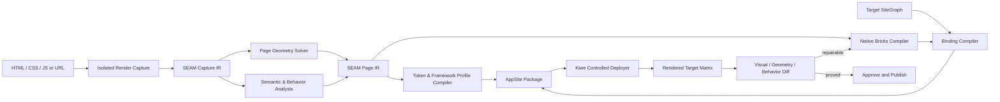

# SEAM AppSite Platform

**Status:** Lead architecture decision and implementation blueprint  
**Date:** 2026-08-02  
**Products:** Kiwe, SEAM Framework, SEAM Compiler, SiteGraph, DSA AppShell  

## Executive decision

Kiwe will become a deterministic AppSite platform for WordPress. The existing BRX Shift name is retired. Its useful compiler code becomes **SEAM Compiler**, a proprietary SEAM Framework product inside the Kiwe platform.

The platform will not ask an AI to write Bricks JSON. AI-generated HTML/CSS/JS is an input artifact, not executable authority. A deterministic compiler captures the rendered page, creates a typed intermediate representation, applies SEAM and Geometry rules, emits native Bricks data, binds it to the target WordPress site through SiteGraph, and proves the result by rendering it again.

The primary invariant is:

> The rendered reference is truth, the typed SEAM IR is the source of compilation, Bricks JSON is a generated artifact, and only Kiwe's controlled deployer may mutate WordPress.

## Product map

| Name | Responsibility | Decision |
| --- | --- | --- |
| **Kiwe** | WordPress MU plugin, DSA AppShell runtime, capabilities, security, controlled deployment, rollback | Remains the installed product and deployment authority |
| **SEAM Framework** | Tokens, semantic vocabulary, responsive contracts, Framework Profiles, reusable design language | Remains the proprietary design and layout contract |
| **SEAM Compiler** | Rendered-page capture, typed IR, geometry inference, native Bricks compilation, proof | Replaces BRX Shift and the regex-led production compiler |
| **SEAM Studio** | Web/desktop interface for capture, conversion reports, preview, deployment and corpus review | Renamed successor to the BRX Shift web interface |
| **SEAM Flow** | Deterministic job graph and state machine for compilation/deployment | Stops being primarily a slash-command prompt router |
| **SiteGraph** | Read-only target-site content, capability and schema truth | Becomes a required input for dynamic binding, not for static compilation |
| **Geometry Engine** | AppShell runtime geometry plus offline page constraint inference | Split into runtime geometry and compiler geometry, sharing contracts but not ownership |
| **DSA AppShell** | Persistent, cache-safe application surface over server-rendered WordPress | Remains lightweight and independent from page-builder rendering |

## Honest product promise

SEAM Compiler will accept arbitrary well-formed web input, but it will never silently claim universal equivalence. Every build must return three explicit scores:

1. **Visual fidelity:** reference-versus-target geometry and perceptual comparison across the tested viewport/state matrix.
2. **Native coverage:** the percentage of render ownership represented by native Bricks elements and controls.
3. **Behavior coverage:** behaviors mapped to Bricks interactions, native browser behavior, WordPress/WooCommerce, or Kiwe capabilities.

Anything not represented is listed as a residual with its selector, source location, reason, fallback and review requirement. A valid JSON file is not proof of a successful conversion.

## Current repository findings

The codebase already contains the difficult platform foundations:

- SiteGraph and public-safe SiteGraph Data;
- SEAM tokens, vocabulary, global-class export and Framework Profiles;
- DSA AppShell slots, capability boundaries and Responsive Geometry Engine;
- Bricks capability introspection, conversion validation and template safety rules;
- controlled staging, approval, rollback, target resolution and post-apply inspection;
- package integrity, cache-safe boot and shared-host runtime constraints;
- responsive UI fixtures and a Playwright geometry harness.

The main failure is not lack of architecture. It is that generation still crosses unsafe boundaries:

- `compile-seamframework.cjs` uses regex inference and value wrapping, so it cannot understand the browser's final cascade, layout or behavior;
- `SeamFlow_Service::compile_seam_html()` also performs regex-based rewriting and injects generic defaults;
- the PHP fallback converter stores most CSS as page custom CSS instead of native Bricks controls;
- the browser converter maps a useful subset of CSS, but it does not capture computed styles, external stylesheets or arbitrary runtime states;
- prompt commands and duplicated validators grew faster than a single canonical compiler contract;
- AI has been asked to reason over artifacts that are too large and too weakly typed.

The supplied Bricks 2.3.10 source does not contain `Bricks\Html_To_Bricks_Converter`. On that version Kiwe's current server-side converter therefore takes its low-fidelity fallback path. SEAM Compiler must be the dependable compiler; optional Bricks-native conversion APIs may be used only when an installed Bricks version actually exposes them.

Baseline at the start of this architecture branch:

- package integrity: 295 files verified;
- toolkit smoke tests: pass;
- SEAM adoption audit: pass;
- RC8 runtime contracts: 11/11 pass;
- connector contracts: 2/84 fail;
- runtime token-purity audit: 10 dark-mode token declarations fail.

No compiler feature branch may be called green until the two existing red gates are repaired or explicitly quarantined with an accepted decision.

## Execution topology

Chromium, screenshot comparison and untrusted JavaScript do not belong on shared WordPress hosting. The platform is deliberately split:

### Compiler plane

Runs in SEAM Studio, a local CLI/desktop worker, CI, or a hosted compilation worker.

- opens the supplied HTML, URL or project bundle in an isolated browser;
- resolves permitted assets and stylesheets;
- records rendered states and computed styles;
- creates typed SEAM intermediate representations;
- compiles Bricks templates and proof artifacts;
- never receives WordPress administrator cookies or production secrets.

### WordPress plane

Runs in the Kiwe MU plugin on shared hosting.

- exposes bounded SiteGraph/capability data;
- validates an AppSite package;
- imports assets, Framework Profiles and Bricks data;
- binds dynamic content using target-site truth;
- creates revisions, stages, verifies, activates and rolls back;
- serves the lightweight DSA AppShell and private hydration endpoints.

This division preserves shared-host performance while still allowing browser-grade compilation.

## Canonical compilation pipeline



### 1. Ingest and normalization

Accepted sources:

- self-contained HTML;
- HTML plus local CSS/JS/assets;
- a public preview URL;
- a ZIP/project bundle with an explicit entry page.

The ingest manifest records hashes, origin, file types, byte sizes and permitted network dependencies. It rejects PHP, server executables, browser extension URLs, credential material and unbounded data URLs.

### 2. Isolated rendered-page capture

Capture executes the page in a sandbox, not inside WordPress. It records a deterministic matrix such as 320, 375, 478, 768, 991, 1280 and 1440 CSS pixels, plus light/dark and declared interaction states.

For every relevant node it records:

- stable capture ID and DOM ancestry;
- semantic/accessibility role, name and landmark information;
- bounding box, scroll box, stacking context and visibility;
- computed style values and the authored declaration that won when available;
- text, media metadata, links and form semantics;
- pseudo-element presence;
- event-listener hints and observed state transitions;
- screenshot region and content hashes.

The capture worker blocks destructive network calls, credential access, downloads, popups and cross-origin mutation. Scripts may run only to render and reveal the supplied design under bounded time/network rules.

### 3. Typed intermediate representations

The compiler must use versioned JSON Schemas:

- `seam.capture.v1` — raw multi-viewport browser evidence;
- `seam.page-ir.v1` — normalized semantic/layout/style tree;
- `seam.behavior-ir.v1` — events, states, targets and authority classification;
- `seam.asset-manifest.v1` — importable media/font/static assets;
- `seam.bricks-plan.v1` — element/control ownership before serialization;
- `kiwe.appsite-package.v1` — signed deployable package and proofs.

Each IR node carries provenance and confidence. Low-confidence classification does not become a destructive or behavioral decision automatically.

### 4. Page Geometry Solver

The existing Runtime Geometry Engine solves the AppShell viewport. The compiler adds a separate **Page Geometry Solver** that infers responsive constraints from observations rather than copying one viewport's pixels.

It compares node measurements across the viewport matrix to infer:

- intrinsic versus fixed sizing;
- container max-width and fluid gutters;
- flex/grid direction, wrapping, gaps and alignment;
- breakpoint discontinuities;
- aspect ratios and media cropping;
- sticky/fixed positioning;
- text reflow, clipping and minimum readable geometry;
- horizontal rails and scroll-snap behavior.

The output is a constraint model. Bricks breakpoint values and SEAM/project variables are compiled from that model. AppShell geometry remains Kiwe runtime authority and is never copied into page CSS.

### 5. Semantic and component inference

Deterministic rules handle headings, text, links, images, lists, sections, buttons, forms, tables, video, navigation and ordinary layout. A versioned Bricks adapter registry maps recognized patterns to specialized Bricks elements when doing so preserves behavior and editability.

AI may assist only when classification is ambiguous, for example distinguishing a testimonial rail from a product rail. The AI receives a bounded IR slice, must return schema-valid candidates with confidence and evidence, and cannot emit Bricks JSON or mutate WordPress.

### 6. Token and Framework Profile compiler

Exact visual values are first clustered by meaning and reuse. Ownership follows this order:

1. official SEAM/Kiwe token when its semantic and property domain match;
2. declared project token for site-specific art direction;
3. genuine fluid formula when multi-viewport evidence proves fluid behavior;
4. element-native literal only when unique and not part of the framework scale.

The compiler must not force every value into a generic Kiwe token, create no-op clamps, or use `var(--token, fallback)` to conceal missing ownership. It emits a Framework Profile plus a project token/class lane. One visual property has one owner: reusable native global class or element-native setting, never both.

### 7. Native Bricks compiler

The compiler serializes from `seam.bricks-plan.v1`, not directly from HTML or AI output.

Rules:

- use Bricks-native semantic elements and controls whenever available;
- discover the installed Bricks element/control schema through Kiwe's Bricks intelligence endpoint;
- maintain versioned adapter profiles for supported Bricks releases;
- do not copy proprietary Bricks source into Kiwe; extract only capability/schema facts from an installed licensed copy;
- preserve SEAM roles and Kiwe capability attributes;
- attach reusable styling to native global classes and unique styling to element settings;
- quarantine unsupported declarations in a selector-scoped residual stylesheet with reasons;
- never use Code elements as a visual or runtime escape hatch;
- validate IDs, parents, children, controls, breakpoints, variables, queries, interactions and template type before packaging.

### 8. Behavior compiler

JavaScript is not translated line by line. Behavior is classified by intent and authority:

- disclosure, tabs, accordion, hover, scroll reveal and simple state transitions may map to Bricks interactions or native HTML;
- cart, checkout, search, save, profile, authentication, notifications, theme switching and AppShell launchers map to Kiwe/WooCommerce/WordPress capabilities;
- navigation and forms retain native/server authority;
- third-party widgets and arbitrary application code become explicit unsupported or integration adapters.

Unknown behavior blocks an “exact behavior” claim but does not have to block a static visual import. The report shows what was removed and what must be reconnected.

### 9. SiteGraph binding compiler

Static compilation does not require SiteGraph. Dynamic deployment does.

The binder resolves abstract intents such as `featured products`, `primary menu`, `post title`, `current product image` or `cart launcher` against the target SiteGraph. It emits real Bricks query-loop controls, dynamic tags and Kiwe attributes only when the target proves they exist. It never invents post IDs, taxonomy IDs, field names or generated Bricks IDs.

### 10. Asset importer

Assets are hashed, deduplicated, type-checked and size-bounded. The deployer sideloads approved media into WordPress, records attachment IDs and rewrites Bricks references. Remote fonts remain opt-in; local/system fonts are preferred. Failed assets produce visible placeholders and blockers rather than broken silent URLs.

### 11. Visual proof and repair loop

The reference and staged Bricks output are rendered with the same browser, viewport, font and theme-state matrix. Proof combines:

- anchor bounding-box deltas;
- computed typography/color/background/border parity;
- overflow and clipping checks;
- accessibility-tree comparison;
- perceptual screenshot differences;
- interaction-state assertions;
- console/network errors;
- native/residual ownership counts.

Deterministic repair rules run first. AI can propose a repair only from the small failed region and evidence packet. Every repair recompiles from IR and reruns the same proof; the system never hand-edits generated JSON without updating its source plan.

## AppSite package

A deployable package contains:

```text
appsite-package.json
framework/kiwe-framework-profile.json
bricks/templates/*.json
bindings/sitegraph-bindings.json
assets/manifest.json
assets/files/*
proof/reference/*
proof/staged/*
proof/report.json
residuals/styles.css
residuals/behavior.json
```

The manifest records source, IR and output hashes; compiler and Bricks adapter versions; target capability requirements; conversion scores; unresolved blockers; and the rollback policy.

## Fast AppSite deployment

Kiwe's deployer performs a transaction-like flow:

1. read target SiteGraph and Bricks capability profile;
2. validate package signatures, hashes, versions and permissions;
3. create WordPress/Bricks revisions and capture current Kiwe state;
4. import/deduplicate assets;
5. install or update the Framework Profile without overwriting non-Kiwe data;
6. stage Bricks templates/pages without publishing;
7. compile target-specific SiteGraph bindings;
8. activate the selected AppShell profile and module configuration;
9. render the proof matrix on staging;
10. require explicit approval for publish;
11. retain one-click rollback to the captured revisions and Kiwe state.

## Shared-host performance contract

The public WordPress runtime must stay independent from the heavy compiler plane.

- server-rendered WordPress/Bricks documents remain canonical and indexable;
- no React/Vue application runtime is required on the public frontend;
- the AppShell is rendered once and progressively hydrated;
- private identity/cart/authority data arrives through bounded `no-store` hydration;
- optional modules load on first use;
- no blocking remote assets, layout polling loops or theme-owned global observers;
- full-document navigation remains the safe baseline; view transitions enhance it when eligible;
- static compiler artifacts are precomputed and cacheable;
- anonymous reads must not create routine database writes;
- object cache is an optimization, not a requirement;
- every release records plugin-added CSS/JS bytes, request/query overhead and module lazy-load cost.

The existing UI theme budget remains enforced. New compiler and deployer code does not ship to visitors unless required by the runtime.

## Six-site learning program

The six live sites become the private golden corpus. They are not prompt examples; they are repeatable compiler fixtures.

For every selected page/template, store sanitized evidence:

- source bundle or capture manifest;
- viewport/theme/state matrix;
- reference screenshots and geometry snapshots;
- expected semantic/component classifications;
- compiled Framework Profile, Bricks plan and template;
- staged screenshots and proof report;
- accepted residuals and regression history.

The corpus should deliberately cover editorial, WooCommerce, long-form, landing-page, navigation, form, dynamic-loop, mobile-rail, dark-mode and AppShell-launcher cases. A new compiler rule must improve or preserve the whole corpus, not only the page that motivated it.

## Keep, replace and retire

### Keep and strengthen

- SiteGraph and SiteGraph Data;
- SEAM vocabulary, token schema and Framework Profile;
- DSA AppShell, Module Registry and UI contract;
- Runtime Geometry Engine;
- Bricks intelligence and the strongest validators;
- controlled executor, revisions, staging, approval and rollback;
- package-manifest integrity and shared-host safety rules;
- current responsive UI harness.

### Replace

- regex-based Seam compilation with capture/IR compilation;
- low-fidelity PHP CSS fallback with the shared native Bricks compiler core;
- duplicated Node/PHP rules with canonical schemas, fixtures and generated language adapters;
- manual “audit command” choreography with a visible job state machine and proof ledger;
- whole-artifact AI generation with bounded classification/repair assistance.

### Retire from the primary product path

- the BRX Shift product name;
- direct AI-to-Bricks-JSON generation;
- “100%” claims without a viewport/state proof report;
- slash commands as the normal end-user workflow;
- validators that duplicate newer canonical rules;
- generated documentation/release-proof clutter for every small internal batch.

Slash commands may remain as compatibility aliases for CLI and MCP users. They call the same job graph; they are not a separate implementation.

## Proposed repository layout

```text
apps/
  seam-studio/                 # renamed BRX Shift UI
packages/
  seam-contracts/              # JSON Schemas and generated types
  seam-capture/                # isolated browser capture
  seam-compiler-core/          # capture IR -> page IR
  seam-geometry/               # offline page constraint solver
  seam-bricks-adapter/         # Bricks plan and version profiles
  seam-visual-proof/           # render/diff/repair evidence
kiwe-ai-toolkit/               # CLI/MCP compatibility adapters
wp-content/mu-plugins/dsa/     # Kiwe runtime and controlled deployer
fixtures/appsite-corpus/       # sanitized golden fixtures only
```

Generated portable handoff copies must come from canonical schemas/runtime sources. They must not be edited independently.

## Delivery milestones

### M0 — Restore a trustworthy baseline

- fix the two connector-contract failures;
- fix or correctly reclassify the ten dark-mode token-purity failures;
- add a root verification command that reports every required gate;
- stop per-commit version churn; bump package/contract versions at coherent release points.

**Exit:** clean branch, all current mandatory gates green.

### M1 — Contracts and shared compiler skeleton

- add versioned IR/AppSite package schemas and generated TypeScript/PHP types;
- move the current browser converter into `seam-bricks-adapter` as a scaffold;
- add a Bricks capability-profile extractor for installed Bricks versions;
- make AI-direct JSON an explicitly unsupported code path.

**Exit:** a static fixture compiles through IR to schema-valid native Bricks JSON with provenance.

### M2 — Render capture and page geometry

- capture external CSS, computed styles, pseudo-elements, assets and multi-viewport boxes;
- implement responsive constraint inference;
- add deterministic semantic/component classification;
- emit residual and behavior reports.

**Exit:** three unrelated static pages compile without fixture-specific rules.

**Implemented on `compiler/render-capture-geometry`:** isolated Chromium capture, the canonical seven-viewport matrix, computed/cascade/pseudo/resource evidence, responsive Geometry inference, native responsive Bricks controls, Framework project variables, and compact content-addressed proof manifests. Two unrelated synthetic fixtures plus the supplied National Chikki homepage are compiler regressions. The real homepage produces 279 elements, 99.9% native-control coverage, zero Code elements, and three declared scoped-CSS exceptions. Pixel-level comparison and interaction-state capture remain M5 proof work; this milestone does not claim universal HTML parity.

### M3 — Framework and native ownership compiler

- compile official/project tokens and Framework Profiles;
- enforce one-owner style rules;
- expand native mappings for lists, forms, tables, navigation, icons, video and common patterns;
- compile responsive controls from geometry evidence.

**Exit:** native coverage and visual proof meet the declared grade on the first corpus set.

**Compiler-plane implementation on `compiler/framework-native-ownership`:** every Page IR node carries deterministic semantic classification, adapter choice, confidence, evidence and limitations. The Bricks plan enforces element-native single ownership, registers Framework project variables, aggregates plain lists/media/vector subtrees only when behavior is equivalent, sanitizes inline SVG into native Bricks SVG elements, and retains navigation/table semantics without inventing widget behavior. Arbitrary form actions and unknown embeds remain explicit review residuals. The National Chikki proof compiles 279 capture nodes into 267 native elements with 12 SVG aggregates, zero Code elements, 100% semantic coverage and 99.9% native-control coverage. M3's visual-proof exit remains open until the M5 staged render/diff lane executes; compiler metrics alone do not certify pixels.

### M4 — SiteGraph binding and asset deployment

- bind menus, posts, products, taxonomies, media and Kiwe capabilities;
- add transactional media import and URL rewriting;
- produce target-specific AppSite packages;
- connect the package to controlled staging and rollback.

**Exit:** one corpus site deploys to staging without invented IDs or manual JSON edits.

**Compiler-plane implementation on `compiler/sitegraph-asset-deployment`:** target-specific compilation now consumes the existing read-only `kiwe.site-graph.v1` contract and emits a sanitized, hashed SiteGraph snapshot; toolkit-compatible `kiwe.bricks-bindings.v1`; a content-addressed asset import plan; and a rollback-safe dry-run deployment plan. Binding inference is intentionally evidence-led: only explicit `data-kiwe-*` and `data-dsa-open-module` intent is compiled, and references absent from SiteGraph become review blockers rather than invented IDs. Assets without verified bytes, MIME and SHA-256 hashes are not import-ready. The emitted Bricks template operation points at the existing Kiwe staging executor, while asset and binding operations remain explicitly blocked behind future trusted adapters. This completes the non-mutating compiler/package half of M4; the milestone exit remains open until a corpus package is applied to an approved staging site, visually audited, and rolled back successfully.

### M5 — Visual proof and bounded repair

- build reference/staged screenshot and geometry comparison;
- add deterministic repair rules;
- add bounded AI repair proposals for low-confidence regions;
- preserve a proof ledger for every iteration.

**Exit:** repeatable conversion results from a clean checkout and identical input hashes.

**Foundation implementation on `compiler/visual-proof-foundation`:** compiled native Bricks elements now expose stable `data-seam-proof-node` provenance. The dependency-free proof engine validates PNG integrity, computes deterministic YIQ pixel diffs, compares Bricks-plan anchor boxes, selected computed styles, semantic roles/accessibility names and new capture diagnostics, and emits per-viewport diff images plus `seam.visual-proof.v1`. Grades are deliberately matrix-scoped: missing or mismatched viewport/state evidence blocks proof, and no report authorizes a universal 100% claim. `seam.repair-plan.v1` turns failed regions into bounded, proposal-only compiler/IR actions; it cannot mutate generated JSON. Proof attachment verifies the package and Bricks-plan anchor hashes, copies verified diff evidence, updates package integrity, and refuses tampered or capture-only evidence. The M5 exit remains open until the first approved WordPress staging render supplies a real candidate capture and passes the canonical seven-viewport matrix.

### M6 — Six-site pilot

- convert representative templates from all six sites;
- classify every residual and expand rules only when reusable;
- measure shared-host runtime overhead and rollback;
- freeze `kiwe.appsite-package.v1` after the corpus gates pass.

**Exit:** no site relies on undocumented manual edits; every accepted exception is recorded.

### M7 — External release

- simplify SEAM Studio to source, capture, compile, proof, connect and deploy;
- publish capability/compatibility matrices instead of universal claims;
- add onboarding, privacy/security guidance and supportable Bricks-version profiles;
- retain an expert CLI/MCP lane over the same deterministic pipeline.

## Git and release policy

- `main` is releasable and protected; red mandatory gates block merges.
- Use `architecture/*`, `compiler/*`, `runtime/*`, `deployer/*`, `fix/*` and `release/*` branches.
- Every behavior change requires a fixture and a failing-then-passing contract test.
- Compiler changes include corpus impact, native/residual deltas and proof hashes in the PR.
- Runtime and compiler releases are versioned independently inside the AppSite manifest.
- Package manifests are rebuilt only after canonical production files change.
- Generated handoff snapshots are updated by one script and committed with their canonical source change.
- No proprietary Bricks source, customer secrets or unsanitized live-site captures enter Git.
- Commits remain atomic; architecture, runtime, compiler and generated artifacts are not mixed without necessity.

## Immediate next batch

1. Repair the red baseline gates on a dedicated fix branch.
2. Add `packages/seam-contracts` with the six initial schemas.
3. Import the BRX Shift converter as `packages/seam-bricks-adapter/scaffold`, preserving its tests but removing the public product name.
4. Add two unrelated synthetic fixtures before changing mapping behavior.
5. Build the first capture-to-IR command and make the current regex compiler a compatibility-only adapter.
6. Compile the National Chikki page through the new IR as the first regression fixture, not as the architecture template.

This sequence converts Kiwe's strongest existing work into a platform while eliminating the exact failure mode that caused the previous AI-generated Bricks attempts.
